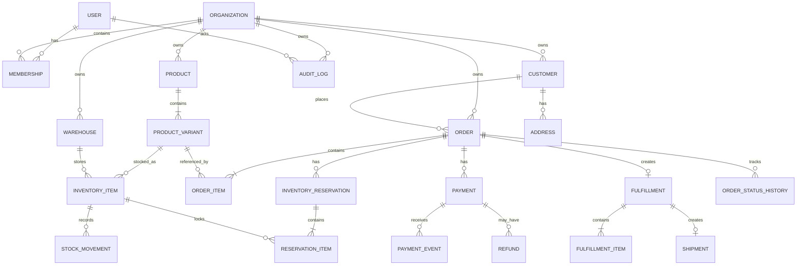

# 04 — مدل دامنه و داده CommerceOps

## 1. اصول مدل‌سازی

- `Organization` مرز Tenant است.
- همه Entityهای Business شناسه UUID عمومی دارند.
- Order، Payment، Stock Movement و Audit Log حذف فیزیکی نمی‌شوند.
- داده تاریخی سفارش Snapshot می‌شود.
- Constraintهای حیاتی در Database نیز اعمال می‌شوند.
- Money با Decimal و Currency ذخیره می‌شود.
- تمام Timestampها UTC هستند.

## 2. Aggregateها

| Aggregate | Root | اعضای اصلی |
|---|---|---|
| Organization | Organization | Membership, Role Assignment |
| Catalog | Product | ProductVariant |
| Inventory | InventoryItem | StockMovement, InventoryReservationItem |
| Order | Order | OrderItem, OrderStatusHistory |
| Payment | Payment | PaymentEvent, Refund |
| Fulfillment | Fulfillment | FulfillmentItem, Shipment |
| Audit | AuditLog | مستقل و Append-only |

## 3. ERD سطح بالا

## 4. Entity Specifications

### 4.1 User

| فیلد | نوع | قید |
|---|---|---|
| id | UUID | PK |
| email | citext/varchar | Global unique, normalized |
| password | hash | Django managed |
| is_active | bool | default true |
| created_at | timestamptz | required |

### 4.2 Organization

| فیلد | نوع | قید |
|---|---|---|
| id | UUID | PK |
| name | varchar(200) | required |
| slug | varchar(80) | unique |
| base_currency | char(3) | required |
| timezone | varchar(64) | default UTC |
| reservation_ttl_minutes | int | check 1..1440, default 15 |
| status | enum | ACTIVE, SUSPENDED |

### 4.3 Membership

| فیلد | نوع | قید |
|---|---|---|
| id | UUID | PK |
| organization_id | FK | required |
| user_id | FK | required |
| role | enum | ORG_ADMIN, SALES, WAREHOUSE_OPERATOR, WAREHOUSE_MANAGER, FINANCE, CUSTOMER |
| status | enum | INVITED, ACTIVE, SUSPENDED |
| warehouse_scope | M2M | nullable; empty means all only for privileged roles |

**Unique:** `(organization_id, user_id)`.

### 4.4 Customer

| فیلد | نوع | قید |
|---|---|---|
| id | UUID | PK |
| organization_id | FK | required |
| linked_user_id | FK nullable | برای Portal مشتری |
| full_name | varchar(200) | required |
| email | varchar(254) nullable | normalized |
| phone | varchar(32) nullable | normalized |
| is_active | bool | default true |

**Unique conditional:** `(organization_id, lower(email))` when email is not null.

### 4.5 Address

فیلدها: `customer_id`, `label`, `recipient_name`, `phone`, `country`, `province`, `city`, `postal_code`, `line1`, `line2`, `is_default`.

تنها یک Address پیش‌فرض برای هر Customer با Unique Constraint شرطی.

### 4.6 Product

فیلدها: `organization_id`, `name`, `description`, `is_active`, timestamps.

### 4.7 ProductVariant

| فیلد | نوع | قید |
|---|---|---|
| id | UUID | PK |
| organization_id | FK | redundant tenant boundary |
| product_id | FK | required |
| sku | varchar(64) | uppercase normalized |
| name | varchar(200) | required |
| unit_price | numeric(18,2) | >= 0 |
| currency | char(3) | = organization.base_currency |
| is_active | bool | default true |

**Unique:** `(organization_id, sku)`.

### 4.8 Warehouse

فیلدها: `organization_id`, `code`, `name`, `is_active`.

**Unique:** `(organization_id, code)`.

### 4.9 InventoryItem

| فیلد | نوع | قید |
|---|---|---|
| id | UUID | PK |
| organization_id | FK | required |
| warehouse_id | FK | required |
| variant_id | FK | required |
| on_hand | integer | >= 0 |
| reserved | integer | >= 0 and <= on_hand |
| low_stock_threshold | integer | >= 0 |
| version | integer | optional optimistic metadata |
| updated_at | timestamptz | required |

**Unique:** `(organization_id, warehouse_id, variant_id)`.

**Check:** `on_hand >= 0 AND reserved >= 0 AND reserved <= on_hand`.

### 4.10 StockMovement

Append-only ledger:

| فیلد | توضیح |
|---|---|
| organization_id | Tenant |
| inventory_item_id | آیتم موجودی |
| type | RECEIPT, ADJUSTMENT_IN, ADJUSTMENT_OUT, SHIPMENT |
| quantity_delta | مثبت یا منفی؛ صفر ممنوع |
| on_hand_before/after | Snapshot |
| reference_type/id | Order, Shipment یا Manual |
| reason | اجباری برای Adjustment |
| actor_id | کاربر یا null برای System |
| created_at | زمان |

### 4.11 Order

| فیلد | نوع/توضیح |
|---|---|
| id | UUID PK |
| organization_id | FK |
| order_number | یکتا در Organization |
| customer_id | FK |
| warehouse_id | FK |
| status | PENDING_PAYMENT, PAID, PROCESSING, SHIPPED, DELIVERED, PAYMENT_FAILED, EXPIRED, CANCELLED |
| currency | char(3) |
| subtotal | numeric(18,2) |
| total | numeric(18,2) |
| shipping_address_snapshot | JSON validated schema |
| created_by_id | FK User |
| created_at/updated_at | timestamps |
| cancelled_at | nullable |
| delivered_at | nullable |

**Unique:** `(organization_id, order_number)`.

### 4.12 OrderItem

| فیلد | توضیح |
|---|---|
| order_id | FK |
| variant_id | FK برای trace؛ حذف نمی‌شود |
| sku_snapshot | immutable |
| name_snapshot | immutable |
| unit_price | immutable Decimal |
| currency | immutable |
| quantity | integer > 0 |
| line_total | quantity × unit_price |

### 4.13 OrderStatusHistory

Append-only: `order_id`, `from_status`, `to_status`, `actor_id`, `reason`, `trace_id`, `created_at`.

### 4.14 InventoryReservation

| فیلد | توضیح |
|---|---|
| id | UUID |
| organization_id | FK |
| order_id | One-to-one |
| status | ACTIVE, CONFIRMED, CONSUMED, RELEASED, EXPIRED |
| expires_at | required |
| created_at/finalized_at | timestamps |

### 4.15 ReservationItem

`reservation_id`, `inventory_item_id`, `order_item_id`, `quantity`.

**Unique:** `(reservation_id, inventory_item_id)`.

### 4.16 Payment

| فیلد | توضیح |
|---|---|
| organization_id | FK |
| order_id | FK |
| provider | `SIMULATOR` |
| provider_reference | unique per provider |
| amount/currency | برابر Order |
| status | PENDING, SUCCEEDED, FAILED, REFUNDED, REVIEW_REQUIRED |
| succeeded_at/failed_at | nullable |
| created_at | required |

**Constraint:** حداکثر یک Payment `SUCCEEDED` برای هر Order با Unique Constraint شرطی.

### 4.17 PaymentEvent

Append-only Webhook Inbox:

- `provider`
- `provider_event_id` unique
- `payment_id` nullable تا resolve
- `event_type`
- `payload_redacted`
- `signature_valid`
- `processing_status`
- `processed_at`

### 4.18 Refund

در MVP تنها برای لغو Order پرداخت‌شده پیش از Picking:

`payment_id`, `amount`, `currency`, `status=SUCCEEDED|FAILED`, `reason`, `provider_reference`, timestamps.

### 4.19 Fulfillment

| فیلد | توضیح |
|---|---|
| order_id | One-to-one |
| warehouse_id | همان Warehouse سفارش |
| status | PENDING, PICKING, PACKED, SHIPPED, CANCELLED |
| started_at/packed_at/shipped_at | nullable |

### 4.20 FulfillmentItem

`fulfillment_id`, `order_item_id`, `quantity_required`, `quantity_picked`.

در MVP `quantity_picked` باید در پایان Picking برابر required باشد.

### 4.21 Shipment

| فیلد | توضیح |
|---|---|
| fulfillment_id | One-to-one در MVP |
| carrier_name | required |
| tracking_code | unique in Organization |
| status | CREATED, IN_TRANSIT, DELIVERED, FAILED |
| shipped_at/delivered_at | nullable |

### 4.22 IdempotencyRecord

| فیلد | توضیح |
|---|---|
| organization_id | FK |
| key | string |
| endpoint | method + path template |
| request_hash | SHA-256 canonical payload |
| state | PROCESSING, COMPLETED, FAILED |
| response_status/body | برای replay |
| expires_at | TTL |

**Unique:** `(organization_id, endpoint, key)`.

### 4.23 AuditLog

Append-only:

`organization_id`, `actor_id`, `action`, `entity_type`, `entity_id`, `before`, `after`, `ip`, `user_agent`, `trace_id`, `created_at`.

## 5. روابط Tenant-safe

هر Service باید تطابق Organization را بررسی کند. مثال:

- `order.organization_id == warehouse.organization_id`
- `order.organization_id == customer.organization_id`
- `variant.organization_id == inventory_item.organization_id`
- `membership.organization_id == request.organization_id`

برای موارد بحرانی، این تطابق باید با Constraint یا Validation Transactional نیز تضمین شود.

## 6. ایندکس‌ها

| جدول | ایندکس |
|---|---|
| Order | `(organization_id, status, created_at desc)` |
| Order | `(organization_id, order_number)` unique |
| Order | `(organization_id, customer_id, created_at desc)` |
| ProductVariant | `(organization_id, sku)` unique |
| InventoryItem | `(organization_id, warehouse_id, variant_id)` unique |
| InventoryReservation | `(status, expires_at)` partial where ACTIVE |
| PaymentEvent | `(provider, provider_event_id)` unique |
| StockMovement | `(organization_id, inventory_item_id, created_at desc)` |
| AuditLog | `(organization_id, entity_type, entity_id, created_at desc)` |
| Shipment | `(organization_id, tracking_code)` unique |

## 7. Data Retention

- Audit، Order، Payment، Stock Movement: حفظ دائمی در Demo؛ حذف از API ممنوع
- Idempotency Record: حداقل 24 ساعت، قابل تنظیم
- Payment Event payload: Redacted و محدود
- Refresh Token blacklist: تا پایان عمر توکن
- Application logs: محیطی و چرخشی

## 8. Migration Rules

- تغییر Model بدون Migration ممنوع
- Data Migration باید Idempotent باشد
- Constraint سنگین پس از Backfill و Validation افزوده شود
- Migration نباید External API فراخوانی کند
- Rollback عملیاتی با Forward Fix ترجیح داده می‌شود
