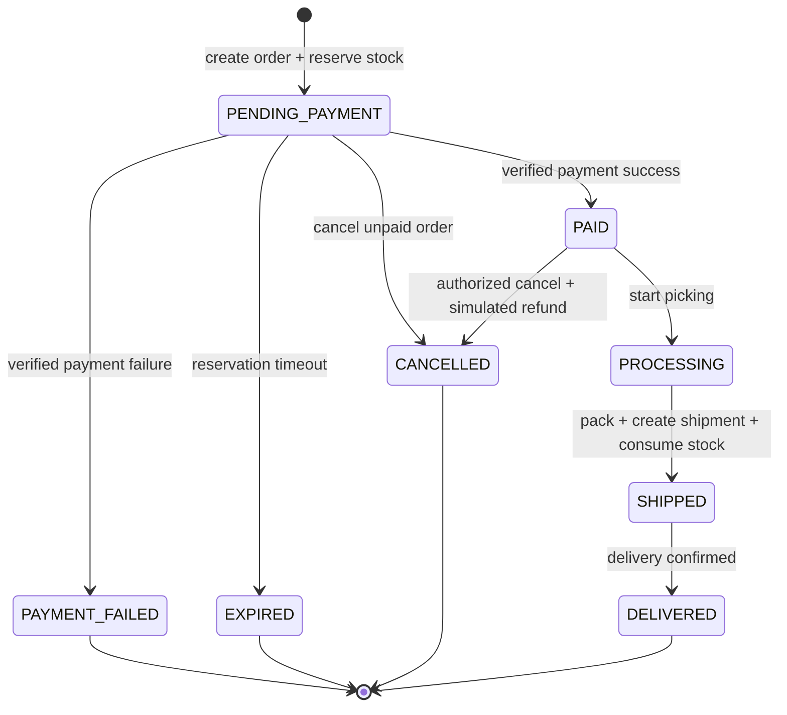
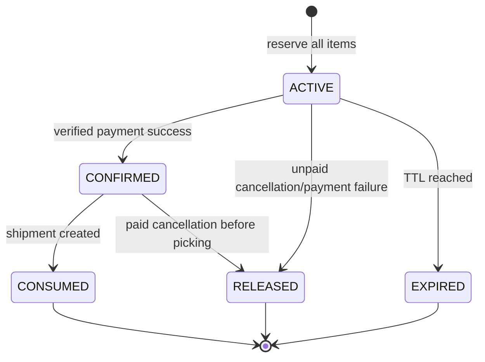
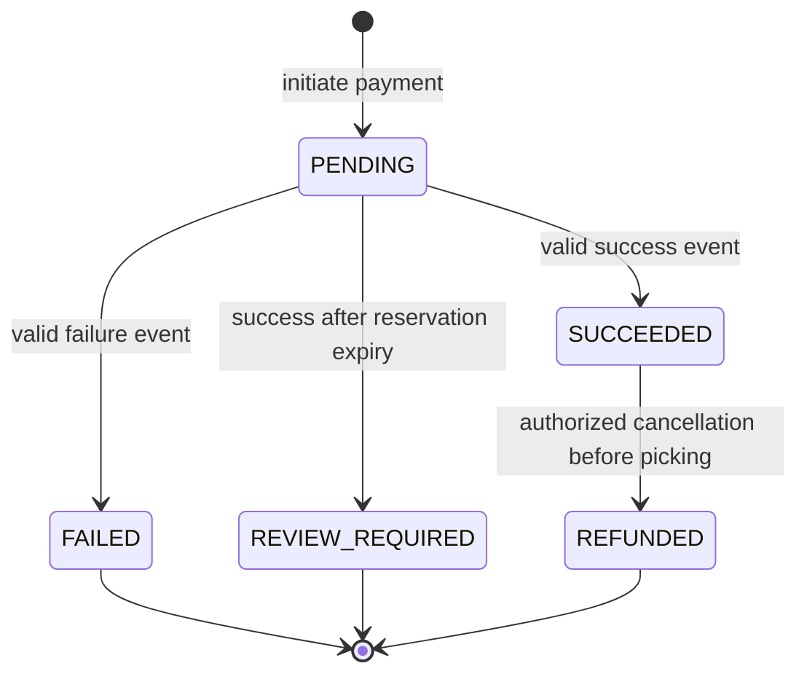
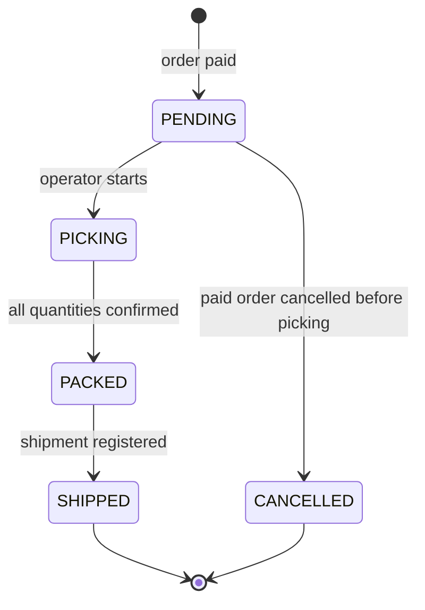

# 05 — Workflowها و قوانین کسب‌وکار CommerceOps

## 1. اصل کلی

Status فیلدی نیست که Client آزادانه مقداردهی کند. هر تغییر وضعیت فقط از طریق Use Case مشخص و پس از بررسی Permission، Precondition و Business Rule انجام می‌شود.

## 2. Workflow سفارش



### Transition Matrix

| From | To | Actor/Trigger | شروط |
|---|---|---|---|
| — | PENDING_PAYMENT | Sales Operator | Customer/Address/Items معتبر؛ رزرو کامل موفق |
| PENDING_PAYMENT | PAID | Payment Webhook | Signature معتبر؛ Amount صحیح؛ Reservation ACTIVE و منقضی‌نشده؛ سپس CONFIRMED |
| PENDING_PAYMENT | PAYMENT_FAILED | Payment Webhook | Event معتبر و Failure |
| PENDING_PAYMENT | EXPIRED | Worker | `expires_at <= now`; Reservation ACTIVE |
| PENDING_PAYMENT | CANCELLED | Sales/Customer مجاز | Order متعلق و Reservation ACTIVE |
| PAID | PROCESSING | Warehouse Operator | Fulfillment موجود؛ Picking شروع شود |
| PAID | CANCELLED | Role مجاز | Picking شروع نشده؛ Refund شبیه‌سازی‌شده موفق |
| PROCESSING | SHIPPED | Warehouse Operator | همه Itemها Picked؛ Packed؛ Shipment معتبر |
| SHIPPED | DELIVERED | Manager/Provider Simulator | Shipment delivered |

## 3. Workflow Reservation



## 4. Workflow Payment



## 5. Workflow Fulfillment



## 6. Business Rules — Inventory

| ID | قانون |
|---|---|
| BRULE-INV-001 | Available برابر `on_hand - reserved` است. |
| BRULE-INV-002 | Quantity رزرو باید عدد صحیح مثبت باشد. |
| BRULE-INV-003 | رزرو چند Item باید All-or-nothing باشد. |
| BRULE-INV-004 | InventoryItemها باید در ترتیب ثابت ID قفل شوند. |
| BRULE-INV-005 | `reserved` هرگز از `on_hand` بیشتر نمی‌شود. |
| BRULE-INV-006 | Expire فقط روی `ACTIVE`، Consume فقط روی `CONFIRMED` و Release روی وضعیت مجاز `ACTIVE` یا `CONFIRMED` انجام می‌شود. |
| BRULE-INV-007 | Release، Confirm و Consume در اجرای دوباره باید Idempotent یا Conflict کنترل‌شده باشند و Quantity را دوباره تغییر ندهند. |
| BRULE-INV-008 | Consume هم‌زمان `reserved` و `on_hand` را کاهش می‌دهد. |
| BRULE-INV-009 | تغییر `on_hand` بدون Stock Movement ممنوع است. |
| BRULE-INV-010 | Adjustment منفی نباید Available را منفی کند. |

### الگوریتم رزرو

```text
BEGIN TRANSACTION
  load and lock all InventoryItem rows ordered by id
  verify every available quantity
  create Order and OrderItems
  increment reserved for all inventory rows
  create ACTIVE Reservation and ReservationItems
  create status history
COMMIT
publish notification after commit
```

در صورت خطای هر Item، کل Transaction rollback می‌شود.

## 7. Business Rules — Order

| ID | قانون |
|---|---|
| BRULE-ORD-001 | Order بدون Item مجاز نیست. |
| BRULE-ORD-002 | همه Variantها باید فعال و متعلق به Organization باشند. |
| BRULE-ORD-003 | همه Itemها از Warehouse انتخاب‌شده موجودی می‌گیرند. |
| BRULE-ORD-004 | SKU تکراری در Payload باید Merge یا Reject شود؛ تصمیم MVP: Reject با Validation Error. |
| BRULE-ORD-005 | قیمت از Server خوانده می‌شود؛ Client نمی‌تواند Unit Price تعیین کند. |
| BRULE-ORD-006 | Snapshot پس از ایجاد Order تغییر نمی‌کند. |
| BRULE-ORD-007 | Total توسط Server محاسبه می‌شود. |
| BRULE-ORD-008 | Status مستقیم از PATCH عمومی قابل تغییر نیست. |
| BRULE-ORD-009 | Cancel از PROCESSING یا بعد از آن در MVP ممنوع است. |
| BRULE-ORD-010 | هر Transition یک Status History و Audit ایجاد می‌کند. |

## 8. Business Rules — Payment

| ID | قانون |
|---|---|
| BRULE-PAY-001 | Payment Amount و Currency باید با Order برابر باشند. |
| BRULE-PAY-002 | تنها یک Payment موفق برای Order مجاز است. |
| BRULE-PAY-003 | Provider Event ID باید یکتا باشد. |
| BRULE-PAY-004 | Webhook نامعتبر هیچ Business State را تغییر نمی‌دهد. |
| BRULE-PAY-005 | Success معتبر، Reservation را از ACTIVE به CONFIRMED می‌برد؛ Success پس از Expiry به REVIEW_REQUIRED می‌رود، نه PAID. |
| BRULE-PAY-006 | Refund MVP فقط کامل و فقط پیش از Picking است. |
| BRULE-PAY-007 | پردازش Event تکراری پاسخ موفق تکرارپذیر می‌دهد، اما Side Effect جدید ندارد. |

## 9. Business Rules — Fulfillment

| ID | قانون |
|---|---|
| BRULE-FUL-001 | Fulfillment فقط برای Order PAID ساخته می‌شود. |
| BRULE-FUL-002 | یک Order در MVP یک Fulfillment دارد. |
| BRULE-FUL-003 | Partial Picking و Partial Shipment خارج از MVP است. |
| BRULE-FUL-004 | Shipment فقط بعد از PACKED ایجاد می‌شود. |
| BRULE-FUL-005 | Tracking Code در Organization یکتا است. |
| BRULE-FUL-006 | Ship باید در یک Transaction موجودی را Consume و وضعیت‌ها را تغییر دهد. |
| BRULE-FUL-007 | Delivery دوباره باید Idempotent باشد. |

## 10. Authorization Matrix

Legend: `R` Read, `C` Create, `U` Update/Action, `—` Denied.

| Resource | Org Admin | Sales | Warehouse Operator | Warehouse Manager | Finance | Customer |
|---|---:|---:|---:|---:|---:|---:|
| Organization settings | U | R | R | R | R | — |
| Membership | C/U/R | — | — | — | — | — |
| Customer | R | C/U/R | R limited | R limited | R | own |
| Catalog | C/U/R | R | R | R | R | R active |
| Inventory | R | R | R scoped | C/U/R scoped | R | — |
| Order | R | C/U/R | R scoped | R scoped | R | own R/cancel unpaid |
| Payment | R | R | R summary | R summary | C/U/R | own summary |
| Fulfillment | R | R | C/U/R scoped | C/U/R scoped | R | own summary |
| Audit | R | — | — | R scoped | R payment | — |

## 11. Failure Scenarios

### 11.1 Insufficient Inventory

- Response: 409 `INSUFFICIENT_INVENTORY`
- هیچ Order یا Reservation ناقص باقی نمی‌ماند.
- جزئیات شامل SKU، requested و available است.

### 11.2 Duplicate Idempotency Key with Different Payload

- Response: 409 `IDEMPOTENCY_KEY_REUSED`
- عملیات جدید اجرا نمی‌شود.

### 11.3 Webhook Replay

- Event قبلی شناسایی می‌شود.
- Response 200/accepted پایدار برمی‌گردد.
- هیچ Transition جدید ثبت نمی‌شود.

### 11.4 Reservation Expires During Payment

- قفل Order/Reservation گرفته می‌شود.
- اگر Expiry قبلاً Commit شده، Payment به REVIEW_REQUIRED می‌رود.
- موجودی دوباره رزرو نمی‌شود.

### 11.5 Concurrent Order Creation

- Row Lock روی InventoryItemها.
- فقط درخواست‌هایی که Available کافی دارند Commit می‌شوند.
- سایر درخواست‌ها 409 دریافت می‌کنند.

### 11.6 Unauthorized Warehouse

- Resource با QuerySet scoped پیدا نمی‌شود.
- Response 404؛ وجود آن افشا نمی‌شود.

## 12. Side Effects

پس از Commit موفق:

- Notification سفارش ایجادشده
- Notification پرداخت موفق/ناموفق
- Notification Shipment
- Metrics increment

Side Effect شکست‌خورده نباید Transaction Business را rollback کند؛ باید Retry و Log شود.
